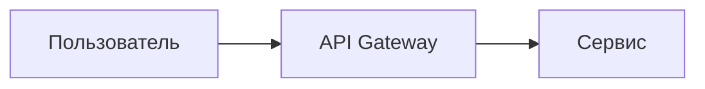

# Mermaid diagrams in YFM

A mermaid diagram is a fenced code block with the `mermaid` language. In
Diplodoc CLI v5 the extension is built in and rendered lazily on the client;
other hosts need @diplodoc/mermaid-extension enabled. Availability of newer
diagram types depends on the bundled mermaid version.

````markdown

````

## Rules that keep diagrams rendering

1. **Quote node labels** with Cyrillic or any of `()[]{}`: `A["Пользователь"]`,
   never `A[Пользователь]`.
2. **Node IDs in Latin, no spaces**: `user`, `apiGw`, `step1`.
3. **Declare direction explicitly**: `graph LR` (pipelines, cause-effect) or
   `graph TD` (sequential flows). Keep it to **~15 nodes**; split larger
   diagrams.
4. Do not hardcode colors (`classDef ... fill:#fff`) - Diplodoc has a dark
   theme, hardcoded fills break on it.
5. Edge labels short: `-->|"Да"|`; at most 3-4 decision diamonds per diagram.

## Common types

| Type | Opener | Use for |
|---|---|---|
| Flowchart | `graph LR` / `graph TD` | processes, architectures |
| Sequence | `sequenceDiagram` | request/response interactions |
| State | `stateDiagram-v2` | lifecycles |
| ER | `erDiagram` | data models |
| Gantt | `gantt` | plans and timelines |
| Pie | `pie` | shares (raw numbers; mermaid computes %) |

Newer types (`mindmap`, `timeline`, `quadrantChart`, `xychart-beta`) require
mermaid >= 10 - check they render in the target host before using.

## Flowchart vocabulary

- Shapes: `["rect"]` process, `("rounded")` start/end, `{"diamond"}` decision,
  `[/"parallelogram"/]` input/output, `(("circle"))` connector,
  `[["subroutine"]]`, `[("cylinder")]` database.
- Edges: `-->` arrow, `---` line, `-.->` dashed, `==>` thick,
  `-->|"label"|` labeled.
- Grouping: `subgraph "Название" ... end`.

## Sequence diagram vocabulary

- Arrows: `->>` sync request, `-->>` response, `--)` async, `--x` failure.
- Blocks: `loop ... end`, `alt ... else ... end`, `opt ... end`,
  `par ... and ... end`.

## Gotchas

- `click` interactions may be blocked by the host's security settings - do not
  rely on them.
- Multi-line node labels: prefer `<br/>` over `\n` (portability depends on
  renderer settings).
- A diagram inside a collapsed `` or an inactive tab renders when
  revealed in Diplodoc, but verify in other hosts - hidden-container rendering
  is a classic failure mode.
